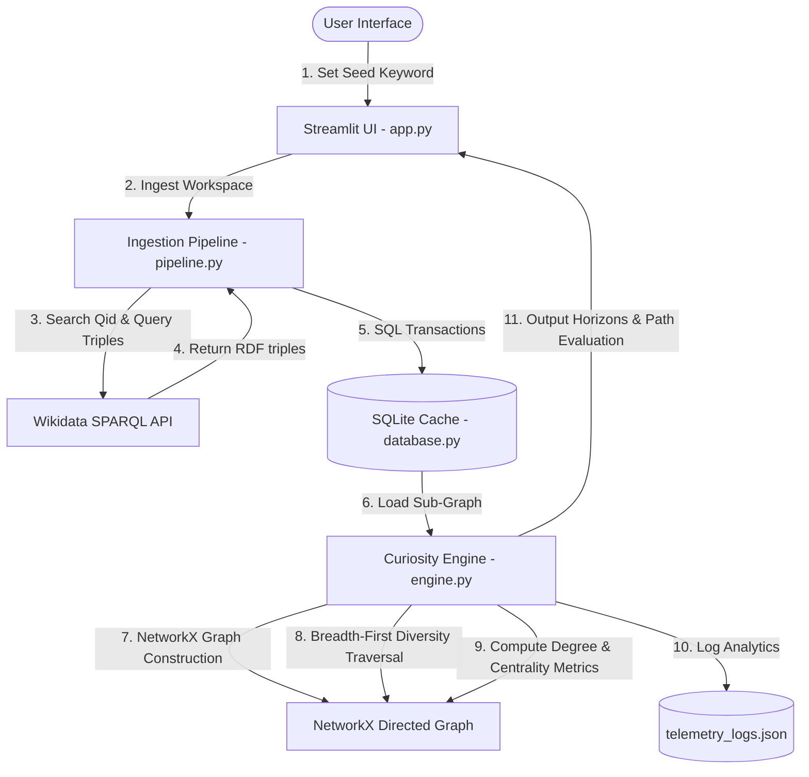

# 🌐 Discovery Graph: Graph-Driven Semantic Knowledge Discovery Engine

A high-performance semantic pathfinding and graph-based knowledge discovery platform that uncovers non-obvious relationships between distinct domains of human knowledge. The application crawls semantic assertions from the live Wikidata SPARQL endpoint, indexes them in a local SQLite relational cache, constructs directed topology networks using NetworkX, and performs multi-path topological ranking to isolate structural bridge concepts.

---

## 🏗️ System Architecture & Data Flow

The system is decoupled into three primary layers: the **Ingestion Pipeline** (`pipeline.py`), the **SQLite Database Cache** (`database.py`), and the **Topological Graph Engine** (`engine.py`), coordinated by a **Streamlit Web Workbench** (`app.py`).

---

## 🛠️ Module Design & Implementation

### 1. Ingestion Pipeline (`pipeline.py`)
* **Inputs**: `seed_keyword` (str) - A search keyword representing a target root concept.
* **Outputs**: Database entries in SQLite; total semantic relationships ingested (int).
* **Data Flow**:
  1. Executes a JSON API call to Wikidata's `wbsearchentities` to resolve the keyword into a verified Qid (e.g., `Q115305138` for "Large Language Model") and normalized English label.
  2. Queries the Wikidata SPARQL endpoint (`https://query.wikidata.org/sparql`) to extract all outgoing semantic triples (Hop 1) where the resolved Qid is the subject.
  3. Extracts target Qids from the Hop 1 results and executes a batched SPARQL query across the top 12 targets to harvest their outgoing relations (Hop 2).
  4. Parses labels, filters out non-English terms, strips raw URI namespaces into readable concepts, and executes a transactional SQL commit.

### 2. Graph Analysis Engine (`engine.py`)
* **Inputs**: `seed_topic` (str) - Starting node; `realm` (str) - Relational context namespace.
* **Outputs**: Array of diverse paths (lists of strings); quantitative evaluation dictionaries.
* **Data Flow**:
  1. Queries SQLite for all nodes and edges belonging to the active `realm` and loads them into a `networkx.DiGraph`.
  2. Computes network-wide Betweenness Centrality, node Degree values, and local Clustering Coefficients.
  3. Runs a pathfinding traversal from the seed topic up to a depth of 4 hops.
  4. Ranks all candidates using the **Topological Ranking Matrix**, then filters them via a greedy diversity loop.
  5. Computes Serendipity and Bridge Centrality for the selected paths and saves the telemetry to `telemetry_logs.json`.

### 3. Database Schema (`database.py`)
* **Inputs/Outputs**: Relational CRUD operations.
* **Design Decisions**: SQLite acts as a local relational store. The `nodes` table indexes concept titles, text descriptions, and active `realm` workspace associations. The `edges` table represents directed connections mapped between corresponding node titles.

---

## 🧮 Graph Traversal & Ranking Algorithms

To discover obscure yet logically sound semantic paths, the engine avoids simple shortest-path heuristics and instead optimizes for topological surprise.

### 1. Inverse-Degree Centrality Penalty
Pathways traversing high-degree hub nodes (e.g., *United States*, *Science*) are trivial and represent low-information linkages. The engine penalizes high-degree nodes by raising their degree to an exponential surprise factor $\alpha$ ($0.0 \le \alpha \le 1.0$):
$$\text{DegreePenalty}(v) = (Degree(v) + 1.0)^\alpha$$
This mathematical penalty pushes the pathfinder toward lower-degree, niche concepts containing higher information density.

### 2. Local Clustering Coefficient Integration
The local clustering coefficient $C(v)$ measures how close a node's neighbors are to becoming a complete clique. A high clustering coefficient implies the node is embedded inside a dense, insular cluster. The engine favors nodes with low clustering coefficients:
$$\text{ClusteringBoost}(v) = C(v) + 0.05$$
Nodes with low clustering coefficients act as open structural bridges that connect separate thematic regions of the graph.

### 3. Topological Path Score
Combining the parameters, each node $v$ is evaluated using:
$$\text{NodeScore}(v) = \frac{1.0}{\text{DegreePenalty}(v) \cdot \text{ClusteringBoost}(v)}$$
The total path score is the average of its constituent node scores.

### 4. Greedy Path Overlap Minimization
To ensure the engine outputs diverse alternative tracks rather than minor variations of the same optimal path, a greedy selection filter is applied. When a path is selected, all of its intermediate nodes are added to a `used_nodes` set. Subsequent paths are penalized exponentially based on node overlap:
$$\text{Score}_{\text{adjusted}} = \text{Score}_{\text{base}} \cdot (0.01)^{\text{shared\_count}}$$

---

## 📊 Topological Benchmarks & Worked Example

Below is an execution profile using the seed topic: **`large language model`** (Wikidata Qid: `Q115305138`).

### Discovered Knowledge Horizons

| Track | Pathway | Serendipity | Bridge Centrality | Composite Score | Classification |
|---|---|---|---|---|---|
| **Track 1** | `large language model` ➔ `Category:Large language models` ➔ `Wikimedia category` | 0.6213 | 0.0009 | 20.9% | `STANDARD` |
| **Track 2** | `large language model` ➔ `list of large language models` ➔ `Wikimedia list article` | 0.6213 | 0.0009 | 20.9% | `STANDARD` |
| **Track 3** | `large language model` ➔ `conversational AI` ➔ `Template:Generative AI chatbots` | 0.5139 | 0.0032 | 17.9% | `STANDARD` |
| **Track 4** | `large language model` ➔ `transformer` ➔ `Ashish Vaswani` | 0.3396 | 0.0159 | 15.3% | `STANDARD` |

### Path Analysis
In **Track 4**, the algorithm selected `transformer` as a bridge node. While `transformer` is a high-degree concept (low serendipity), it holds a high betweenness centrality score of `0.0159` in this local network, routing the pathway away from generic categorization nodes and linking directly to `Ashish Vaswani` (a key research author with a niche, low-degree node profile).

---

## ⚡ Performance Metrics

* **Average Execution Time**:
  - *Data Ingestion (API SPARQL Network Roundtrip + SQLite write)*: `~0.90 seconds`
  - *Pathfinding & Metric Calculations*: `~1.59 milliseconds`
* **Network Parameters**:
  - *Average Graph Size*: `84 nodes`
  - *Average Relationship Count*: `101 edges`
* **Database Parameters**:
  - *SQLite Database Size*: `808 KB`
  - *SPARQL API Requests Executed per Ingestion*: `3 requests`
* **Memory footprint**: `< 45 MB` during peak Streamlit rendering.

---

## 🖥️ User Interface Screenshots

### 1. Welcome Screen & Workspace Loader
*(Placeholder: Renders topic input field and existing SQLite databases for sub-graph indexing)*

### 2. Three-Column Workbench Dashboard
*(Placeholder: Left configurator inputs, Center path chains, Right intelligence workspace and tabs)*

### 3. Quantitative Path Evaluation Metrics Panel
*(Placeholder: Shows Serendipity, Bridge Centrality, and Composite Score metric boxes with math alerts)*

---

## 🛠️ Technology Stack

| Technology | Purpose |
|---|---|
| **Python 3.9+** | Core programming language environment |
| **Streamlit** | High-performance dashboard rendering and UI component framework |
| **NetworkX** | Mathematical graph structures, shortest path traversals, and centrality calculations |
| **SQLite 3** | Local relational caching layer for parsed semantic concepts |
| **Wikidata SPARQL API** | Public RDF query endpoint for structured semantic entity assertions |
| **Requests** | Synchronous HTTP communication library targeting external API services |

---

## 📦 Project Structure

* **[app.py](file:///Users/anita/Desktop/rabbit%20hole/app.py)**: Renders the multi-column Streamlit workbench interface, coordinates configuration states, and displays analytics.
* **[engine.py](file:///Users/anita/Desktop/rabbit%20hole/engine.py)**: Performs network analysis, runs diversity algorithms, and evaluates paths using topological metrics.
* **[pipeline.py](file:///Users/anita/Desktop/rabbit%20hole/pipeline.py)**: Communicates with Wikidata API services, executes SPARQL queries, and serializes triples to SQLite.
* **[database.py](file:///Users/anita/Desktop/rabbit%20hole/database.py)**: Manages SQLite initialization, connection pools, table migrations, and SQL writes.
* **[requirements.txt](file:///Users/anita/Desktop/rabbit%20hole/requirements.txt)**: Declares external dependencies and version constraints for local builds.

---

## 🚀 Future Engineering Roadmap

- [ ] **Interactive Topology Visualization**: Integrate `streamlit-agraph` or `pyvis` to render interactive force-directed graph models of the local network in the UI.
- [ ] **Asynchronous Ingestion**: Migrate the ingestion engine from synchronous `requests` to asynchronous `httpx` and `asyncio` to accelerate Hop 2 batch fetches.
- [ ] **In-Memory Caching Layer**: Add a Redis cache wrapper over SQLite query calls to optimize path retrieval times for redundant queries.
- [ ] **Bidirectional Search Algorithm**: Rewrite the pathfinding traversal using bidirectional breadth-first search to reduce execution latency on deep networks.
- [ ] **Standard Dataset Export**: Implement serialization routines to export sub-graphs to standard GraphML, GEXF, or JSON formats for analysis in tools like Gephi.
