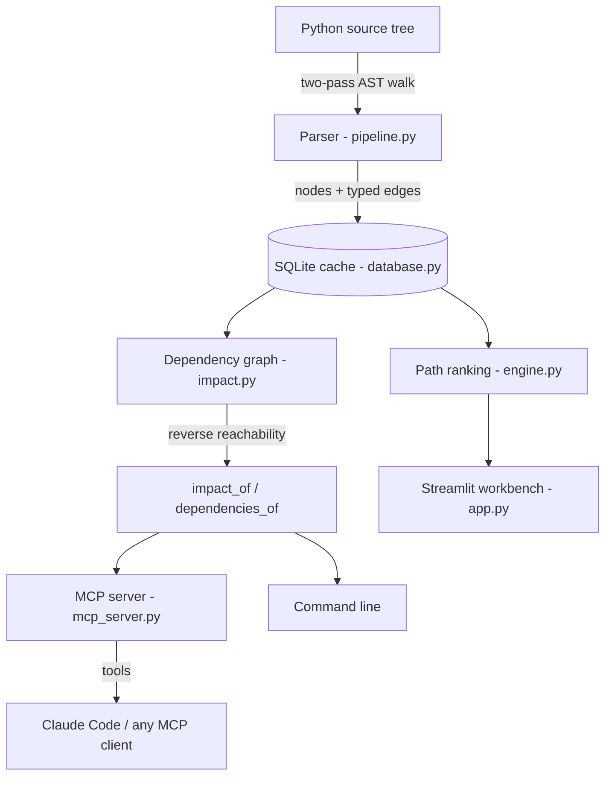

# 🌐 SynapseHorizon: Codebase Dependency & Impact Analysis

Static analysis that answers the question developers actually ask before touching code:

> **"If I change this, what breaks?"**

SynapseHorizon parses a Python codebase into a dependency graph, then walks that graph *backwards* to find every caller of a symbol — including indirect ones that text search cannot see. It exposes those answers over [MCP](https://modelcontextprotocol.io), so AI coding assistants can consult real structure instead of inferring it from grep.

---

## Why this exists

AI coding assistants reason about repository structure by searching text and guessing. They miss indirect callers, inherited overrides, and cross-module chains. A parsed call graph doesn't — it knows that editing `fetch_graph_data` reaches `CuriosityEngine.__init__` two hops away, and it can show the chain.

That precision is the product. The graph is the means.

---

## 🏗️ Architecture


```mermaid
graph TD
    Src[Python source tree] -->|two-pass AST walk| PL[Parser - pipeline.py]
    PL -->|nodes + typed edges| DB[(SQLite cache - database.py)]
    DB --> IM[Dependency graph - impact.py]
    IM -->|reverse reachability| Q[impact_of / dependencies_of]
    Q --> MCP[MCP server - mcp_server.py]
    Q --> CLI[Command line]
    MCP -->|tools| AI[Claude Code / any MCP client]
    DB --> EG[Path ranking - engine.py]
    EG --> UI[Streamlit workbench - app.py]
```

| Module | Role |
|---|---|
| [`pipeline.py`](pipeline.py) | Two-pass AST parser. Extracts symbols, resolves calls to fully-qualified names, emits typed edges. |
| [`database.py`](database.py) | Realm-scoped SQLite cache of nodes and edges. |
| [`impact.py`](impact.py) | Dependency graph and the impact queries. Also a CLI. |
| [`mcp_server.py`](mcp_server.py) | Exposes the queries as MCP tools. |
| [`engine.py`](engine.py) | Centrality-based path ranking (earlier direction, retained). |
| [`app.py`](app.py) | Streamlit workbench over `engine.py`. |

---

## 🚀 Getting started

```bash
python3 -m venv .venv && .venv/bin/python -m pip install -r requirements.txt
```

Index a codebase:

```bash
.venv/bin/python -c "from pipeline import ingest_codebase; ingest_codebase('/path/to/repo')"
```

Ask what breaks:

```bash
.venv/bin/python impact.py impact fetch_graph_data
```

```
Changing database.fetch_graph_data could affect 6 symbol(s):

  ── directly ──
    engine.CuriosityEngine.load_graph  (method, 1 dependents)
    impact.CodeGraph._load  (method, 1 dependents)
    engine  (module, 0 dependents)
    impact  (module, 0 dependents)
  ── 2 hops away ──
    engine.CuriosityEngine.__init__  (method, 0 dependents)
      via engine.CuriosityEngine.__init__ <- engine.CuriosityEngine.load_graph <- database.fetch_graph_data
    impact.CodeGraph.__init__  (method, 0 dependents)
      via impact.CodeGraph.__init__ <- impact.CodeGraph._load <- database.fetch_graph_data
```

(Modules appear alongside their functions because a module-level `import` is
itself a dependency edge.)

Other subcommands: `deps <symbol>`, `find <query>`, `stats`.

### Using it from Claude Code

[`.mcp.json`](.mcp.json) registers the server for this project — restart Claude Code and approve it. Then ask in plain language: *"what breaks if I change fetch_graph_data?"*

Tools exposed: `impact_of`, `dependencies_of`, `find_symbol`, `index_codebase`, `list_codebases`.

---

## 🧠 How it works

### Dependency edges vs structural edges

The central distinction. An edge `A --calls--> B` means A depends on B, so a change to B propagates back to A. An edge `module --contains--> class` means no such thing — containment describes where code lives, not what relies on what.

Keeping both in one graph makes reachability leak: you hop from a method up into its file, then back down into an unrelated method, until every symbol appears connected to every other. `impact.py` keeps them in **separate graphs**, and only `calls` / `inherits` / `imports` carry a change forward.

### Impact = reverse reachability

Multi-source breadth-first search over the reversed dependency graph. BFS (not DFS) so the recorded path is the *shortest* chain of blame. Querying a class also seeds from its methods, since changing a class means changing what it contains.

Results are ranked by distance, then by fan-in — a nearby symbol that many other things depend on is the more dangerous one.

### Call resolution

The parser tracks variable types well enough to resolve the common patterns that defeat string matching:

```python
self.db = Database()   # in __init__
self.db.save(row)      # → store.Database.save

local = Database()
local.save(row)        # → store.Database.save

def handler(db: Database):
    db.save(row)       # → store.Database.save
```

Types come from constructor calls, parameter annotations, and annotated assignments. Class bodies are pre-scanned before their methods are visited, because a method using `self.db` may be defined above the `__init__` that creates it.

---

## ⚠️ Known limitations

Resolution is heuristic, not a type checker. It is **incomplete, and errors run toward under-reporting**: a listed caller is reliable, but "nothing depends on this" is the answer to distrust.

Not currently resolved:

- **Return-value chaining** — `get_connection().execute()`
- **Cross-module inference** — a variable assigned from a function defined elsewhere
- **Containers** — `handlers = [Foo()]` then `handlers[0].run()`
- **Reassignment** — last-write-wins, so a variable changing type mid-function records wrong
- **Duck typing** — unsolvable without full type inference

Measured on this repository: 74 local symbols, 77 dependency edges.

On networkx (580 files): 14,118 nodes and 62,143 raw edges parsed in 2.3s with zero parse errors — but the local dependency graph holds only 2,026 unique edges, and just 2,193 of 8,278 local symbols participate in even one. That is a realistic picture of coverage on large untyped code, and the honest reason to treat a negative result as inconclusive. Closing the gap means integrating `pyright` or `scip-python`.

Python only. No type stubs, no cross-language support.

---

## 🛠️ Stack

Python 3.10+ · NetworkX · SQLite · `ast` · MCP SDK · Streamlit (workbench only)

---

## 🗺️ Roadmap

- [ ] **Entrypoints and test mapping** — detect `test_*`, `__main__`, and route handlers so results can say *"5 break, 2 have no test coverage"*, and so dead code becomes findable.
- [ ] **Git co-change coupling** — symbols that always change in the same commit are coupled even with no call edge between them. Structural analysis cannot see this.
- [ ] **Diff blast radius** — run impact analysis across a branch or PR rather than a single symbol.
- [ ] **Context packing** — assemble the minimal token-budgeted set of definitions needed to modify a symbol.
- [ ] **Real name resolution** — delegate to `pyright` for the cases heuristics cannot reach.
- [ ] **Subsystem detection** — community detection on the module graph, rendered as Mermaid.

---

## 📜 Project history

This began as a Wikipedia "rabbit hole" explorer, then became a codebase path-finder that ranked routes through a call graph by centrality and "serendipity." That framing didn't survive contact with the problem — its own worked example returned four suggestions with identical scores, three of them terminating in `range`, `enumerate`, and `set`.

The diagnosis: serendipity is a *recommender-systems* metric. Wandering is the point on Wikipedia. Nobody wants to wander their codebase — they want a specific answer to a specific, anxious question. The graph was worth keeping; the objective on top of it was not.

`engine.py` and `app.py` retain the path-ranking direction and still run.
