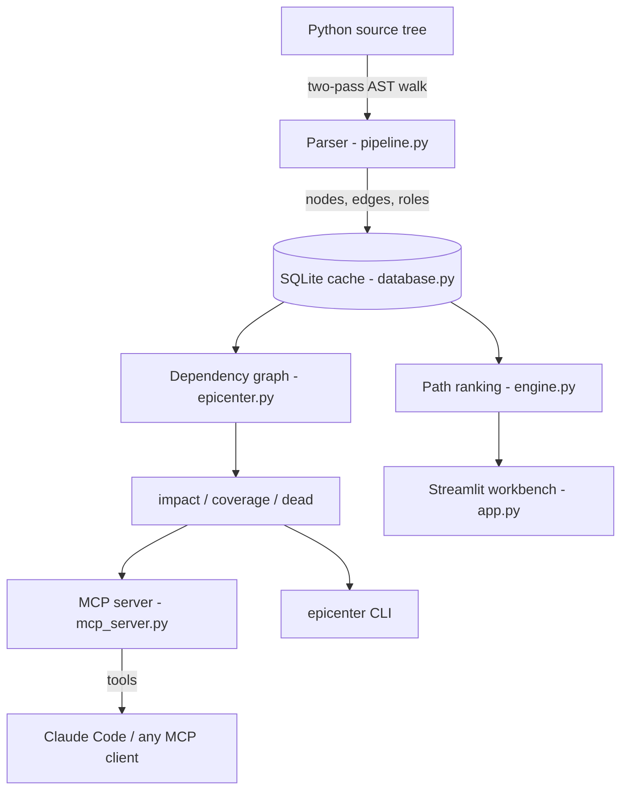

# 🌐 Epicenter

**Name a symbol. See everything that shakes.**

Epicenter parses a Python codebase into a dependency graph, then walks that graph *backwards* to answer the question developers actually ask before touching code:

> **"If I change this, what breaks?"**

It finds indirect callers that text search cannot see, tells you which of them no test reaches, and exposes all of it over [MCP](https://modelcontextprotocol.io) so AI coding assistants can consult real structure instead of inferring it from grep.

---

## Why this exists

AI coding assistants reason about repository structure by searching text and guessing. They miss indirect callers, inherited overrides, and cross-module chains. A parsed call graph doesn't — it knows that editing `fetch_graph_data` reaches `CuriosityEngine.__init__` two hops away, and it can show the chain.

That precision is the product. The graph is the means.

---

## 🚀 Quick start

```bash
python3 -m venv .venv && .venv/bin/python -m pip install -e .
```

Index a codebase, then ask:

```bash
.venv/bin/epicenter index /path/to/repo   # or: python -c "from pipeline import ingest_codebase; ingest_codebase('.')"
.venv/bin/epicenter impact save_user
```

```
Changing db.save_user could affect 5 symbol(s):

  ── directly ──
    api.create_account  (function, 3 dependents)  [UNTESTED]
  ── 2 hops away ──
    web.signup_handler  (function, 0 dependents)
      via web.signup_handler <- api.create_account <- db.save_user

  1 of 5 affected symbol(s) have no test reaching them.
```

| Command | Answers |
|---|---|
| `impact <symbol>` | What breaks if this changes |
| `deps <symbol>` | What this relies on — the code to read first |
| `coverage <symbol>` | Which tests reach it |
| `dead` | Symbols no entrypoint or test can reach |
| `find <query>` | Look up a symbol's qualified name |
| `index <path>` | Parse a codebase into the graph |
| `stats` | Graph size, entrypoints, tests, coverage, unresolved calls |

### From Claude Code

[`.mcp.json`](.mcp.json) registers the server for this project — restart Claude Code and approve it. Then ask in plain language: *"what breaks if I change fetch_graph_data?"*

Tools: `impact_of`, `test_coverage`, `dead_code`, `dependencies_of`, `find_symbol`, `index_codebase`, `list_codebases`.

---

## 🏗️ Architecture


```mermaid
graph TD
    Src[Python source tree] -->|two-pass AST walk| PL[Parser - pipeline.py]
    PL -->|nodes, edges, roles| DB[(SQLite cache - database.py)]
    DB --> IM[Dependency graph - epicenter.py]
    IM --> Q[impact / coverage / dead]
    Q --> MCP[MCP server - mcp_server.py]
    Q --> CLI[epicenter CLI]
    MCP -->|tools| AI[Claude Code / any MCP client]
    DB --> EG[Path ranking - engine.py]
    EG --> UI[Streamlit workbench - app.py]
```

| Module | Role |
|---|---|
| [`pipeline.py`](pipeline.py) | Two-pass AST parser. Symbols, call resolution, role detection. |
| [`database.py`](database.py) | Realm-scoped SQLite cache. |
| [`epicenter.py`](epicenter.py) | Dependency graph, impact/coverage/reachability queries, CLI. |
| [`mcp_server.py`](mcp_server.py) | The queries as MCP tools. |
| [`engine.py`](engine.py) | Centrality-based path ranking (earlier direction, retained). |
| [`app.py`](app.py) | Streamlit workbench over `engine.py`. |

---

## 🧠 How it works

### Dependency edges vs structural edges

The central distinction. An edge `A --calls--> B` means A depends on B, so a change to B propagates back to A. An edge `module --contains--> class` means no such thing — containment describes where code lives, not what relies on what.

Keeping both in one graph makes reachability leak: you hop from a method up into its file, then back down into an unrelated method, until every symbol appears connected to every other. Epicenter keeps them in **separate graphs**, and only `calls` / `inherits` / `imports` carry a change forward.

### Impact = reverse reachability

Multi-source breadth-first search over the reversed dependency graph. BFS (not DFS) so the recorded path is the *shortest* chain of blame. Querying a class also seeds from its methods, since changing a class means changing what it contains. Results rank by distance, then fan-in — a nearby symbol many things depend on is the more dangerous one.

### Call resolution

The parser tracks variable types well enough to resolve the patterns that defeat string matching:

```python
self.db = Database()   # learned in __init__
self.db.save(row)      # → store.Database.save

local = Database()
local.save(row)        # → store.Database.save

def handler(db: Database):
    db.save(row)       # → store.Database.save
```

Types come from constructor calls, parameter annotations, and annotated assignments. Class bodies are pre-scanned before their methods are visited, because a method using `self.db` may be defined above the `__init__` that creates it.

### Roots, and what static analysis cannot see

Coverage and dead code both need to know where execution starts. Epicenter treats as roots: `__main__` guards, module-level `main`/`cli`, tests, decorator-registered functions, and modules nothing imports but which have module-level code (Streamlit apps and scripts, which never write a `__main__` guard).

Getting dead code from noisy to useful meant handling four ways a framework invokes code with no call edge to show for it:

| Invisible call | How it's handled |
|---|---|
| `ast.NodeVisitor` dispatching to `visit_Call` | A class with an **external** base may have overrides its base calls |
| `@app.route`, `@mcp.tool`, `@pytest.fixture` | Any **non-inert** decorator means registration. Enumerating inert decorators is tractable; enumerating every framework's registering ones is not |
| `@property` read as an attribute | Descriptor decorators marked implicit |
| `Foo()` linking to `Foo`, never `Foo.__init__` | Reachability computed to a **fixpoint**, so a live class pulls in its dunders and whatever they call |

On this repository that took the dead list from 46 entries to 1 — and the survivor is real.

---

## ⚠️ Known limitations

Resolution is heuristic, not a type checker. It is **incomplete, and errors run toward under-reporting**: a listed caller is reliable, but *"nothing depends on this"* is the answer to distrust.

Not currently resolved:

- **Return-value chaining** — `get_connection().execute()`
- **Cross-module inference** — a variable assigned from a function defined elsewhere
- **Containers** — `handlers = [Foo()]` then `handlers[0].run()`
- **Reassignment** — last-write-wins, so a variable changing type mid-function records wrong
- **Duck typing** — unsolvable without full type inference

Two more things to hold loosely:

- **Test coverage here means reachability**, not assertion. A test that reaches a symbol may not check anything about it. It is a floor on confidence, not a measure of it.
- **Dead code is a list of candidates**, never a delete list. An unresolved caller makes live code look dead.

`stats` reports **`unresolved_calls`** — call sites the parser could not tie to any symbol. Those targets are typed `unresolved` rather than filed as external libraries, so the size of the blind spot is visible instead of hidden. On this repository it currently sits at 31.

Measured on this repository: 149 symbols, 145 dependency edges, 13 entrypoints, 50 tests, 1 unreachable symbol. On networkx (580 files): 14,118 nodes and 62,143 raw edges parsed in 2.3s with zero parse errors — but only 2,026 unique local dependency edges, with 2,193 of 8,278 local symbols participating in even one. That is a realistic picture of coverage on large untyped code, and the honest reason to treat a negative result as inconclusive. Closing the gap means integrating `pyright` or `scip-python`.

Python only.

---

## 🧪 Tests

```bash
.venv/bin/python -m pytest tests -q
```

41 tests covering call resolution, storage, impact queries, and reachability. Most are regressions for bugs that were found by running Epicenter on itself — the realm-collision data loss, the `test_`-prefix misclassification, closures collapsing into one node, and each of the framework-dispatch false positives in the dead-code list.

---

## 🛠️ Stack

Python 3.10+ · NetworkX · SQLite · `ast` · MCP SDK · Streamlit (workbench only)

---

## 🗺️ Roadmap

- [ ] **Git co-change coupling** — symbols that always change in the same commit are coupled even with no call edge between them. Structural analysis cannot see this.
- [ ] **Diff blast radius** — impact analysis across a branch or PR rather than a single symbol.
- [ ] **Context packing** — the minimal token-budgeted set of definitions needed to modify a symbol.
- [ ] **Real name resolution** — delegate to `pyright` for what heuristics cannot reach.
- [ ] **Subsystem detection** — community detection on the module graph, rendered as Mermaid.

---

## 📜 Project history

This began as a Wikipedia "rabbit hole" explorer, became a codebase path-finder that ranked routes by centrality and "serendipity," and is now Epicenter.

The path-ranking framing didn't survive contact with the problem — its own worked example returned four suggestions with identical scores, three terminating in `range`, `enumerate`, and `set`. Serendipity is a *recommender-systems* metric: wandering is the point on Wikipedia, but nobody wants to wander their codebase. They want a specific answer to a specific, anxious question.

The graph was worth keeping. The objective on top of it was not. `engine.py` and `app.py` retain the older direction and still run.
