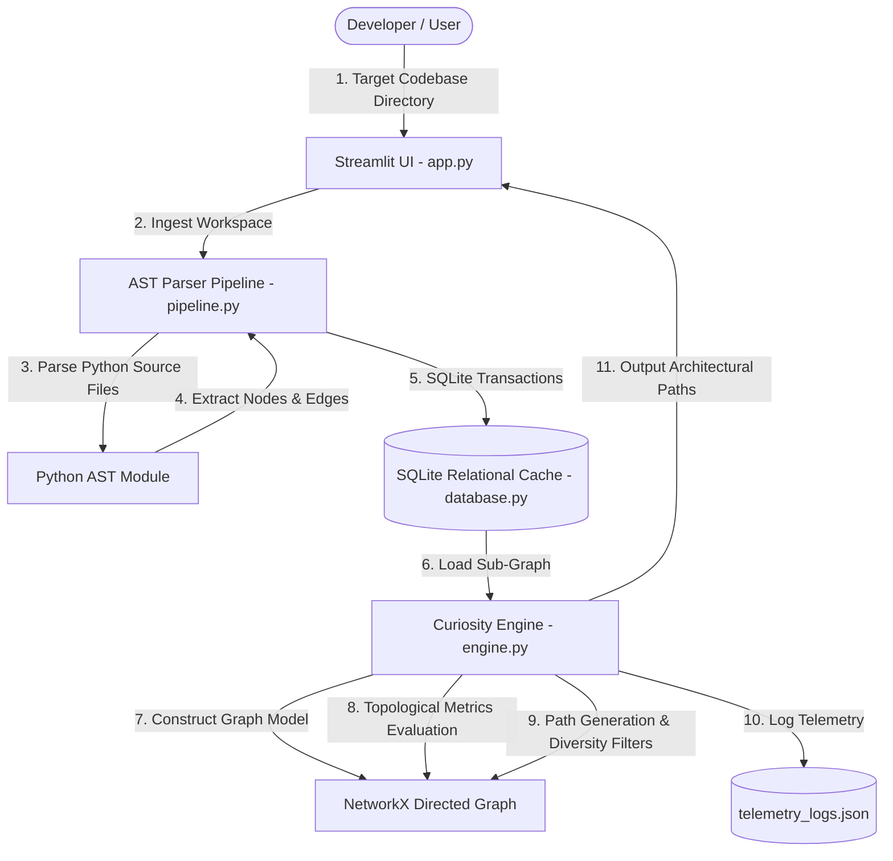

# 🌐 SynapseHorizon: Graph-Based Codebase Architecture understanding Engine

A high-performance static code analysis and graph-based pathway discovery engine that maps and ranks architectural execution tracks within codebases. By parsing Python Abstract Syntax Trees (AST), resolving call/containment/inheritance topologies, and applying network analysis algorithms, the engine discovers and surfaces the most informative structural paths through complex systems. 

This platform solves the limitations of localized code tools (e.g. call hierarchy, find references, grep) by tracing multi-hop structural paths across subsystems using degree, betweenness centrality, and clustering coefficient heuristics.

---

## 🏗️ System Architecture & Data Flow

The codebase analysis pipeline is organized into three decoupled layers: **AST Code Parser** (`pipeline.py`), **SQLite Database Cache** (`database.py`), and **Topological Graph Engine** (`engine.py`), coordinated via a **Streamlit Web Workbench** (`app.py`).

```mermaid
graph TD
    User([Developer / User]) -->|1. Target Codebase Directory| UI[Streamlit UI - app.py]
    UI -->|2. Ingest Workspace| PL[AST Parser Pipeline - pipeline.py]
    PL -->|3. Parse Python Source Files| AST[Python AST Module]
    AST -->|4. Extract Nodes & Edges| PL
    PL -->|5. SQLite Transactions| DB[(SQLite Relational Cache - database.py)]
    DB -->|6. Load Sub-Graph| EG[Curiosity Engine - engine.py]
    EG -->|7. Construct Graph Model| NX[NetworkX Directed Graph]
    EG -->|8. Topological Metrics Evaluation| NX
    EG -->|9. Path Generation & Diversity Filters| NX
    EG -->|10. Log Telemetry| TM[(telemetry_logs.json)]
    EG -->|11. Output Architectural Paths| UI
```

---

## 🛠️ Module Design & Implementation

### 1. AST Code Parser (`pipeline.py`)
* **Inputs**: `repo_path` (str) - Directory containing Python source files.
* **Outputs**: Serialized AST nodes and relationships stored in SQLite; call graph edges count (int).
* **Data Flow**:
  1. Walks the repository directory tree (excluding cache and environment folders).
  2. Parses each Python file using Python's standard `ast.parse` module to extract classes, class methods, functions, and import statements.
  3. Translates AST calls (e.g., `self.method()` or `nx.DiGraph()`) into fully-qualified concept names by resolving references against local module imports and class structures.
  4. Generates dependency containment edges (`module contains class`, `class contains method`), inheritance edges (`class inherits base_class`), and call edges (`method calls function`).

### 2. Graph Analysis Engine (`engine.py`)
* **Inputs**: `seed_topic` (str) - Starting code component; `realm` (str) - Codebase repository path.
* **Outputs**: Array of diverse paths (lists of strings); path evaluation metric dicts.
* **Data Flow**:
  1. Loads SQLite nodes and edges matching the repository `realm` into a `networkx.DiGraph`.
  2. Computes network-wide Betweenness Centrality, node Degree centralities, and local Clustering Coefficients.
  3. Traces candidate execution paths up to a depth of 4 hops starting from the seed component.
  4. Scores candidate paths using the **Topological Ranking Matrix**, then filters them via a greedy diversity loop.
  5. Computes path metrics and logs session telemetry to `telemetry_logs.json`.

### 3. SQLite Relational Cache (`database.py`)
* **Inputs/Outputs**: Relational DB transaction wrappers.
* **Design Decisions**: SQLite acts as a local relational store. The `nodes` table indexes component titles (e.g., `engine.CuriosityEngine.load_graph`), code signatures/summaries, node type (`class`, `method`, `function`, `module`, `external`), and `realm` directory references. The `edges` table represents relationships (`calls`, `contains`, `imports`, `inherits`).

---

## 🧮 Graph Traversal & Ranking Algorithms

To discover informative, high-density architectural paths, the engine avoids trivial shortest-paths and instead optimizes for topological significance.

### 1. Hub Penalty
Utility helpers (e.g. `utils`, `helpers`, `config`) and common standard libraries (e.g. `sys`, `os`, `json`) have high degree. We apply a degree centrality penalty:
$$\text{DegreePenalty}(v) = (Degree(v) + 1.0)^\alpha$$
With a surprise factor $\alpha = 0.7$.
* Multipliers are added to scale the penalty up (e.g., $5\times$ for utility naming matches, $2\times$ for external library nodes), forcing the pathfinder to route through local domain logic.

### 2. Bridge Reward
Architectural orchestrators often connect different subsystems. We boost components with high betweenness centrality (fraction of shortest paths routing through them):
$$\text{BridgeMultiplier}(v) = 1.0 + (\text{Betweenness}(v) \cdot 50.0)$$

### 3. Clustering Coefficient Penalty
Measures the cliquishness of a node. Low local clustering coefficients ($C(v)$) indicate the node connects separate thematic areas of the codebase:
$$\text{ClusteringBoost}(v) = C(v) + 0.05$$

### 4. Topological Path Score
Combining the parameters, each node $v$ is evaluated using:
$$\text{NodeScore}(v) = \frac{\text{BridgeMultiplier}(v) \cdot \text{TypeBoost}(v)}{\text{DegreePenalty}(v) \cdot \text{ClusteringBoost}(v)}$$
The path score is the average of its node scores.

### 5. Greedy Path Overlap Minimization
To ensure the engine outputs diverse alternative tracks rather than minor variations of the same optimal path, a greedy selection filter is applied. When a path is selected, all of its intermediate nodes are added to a `used_nodes` set. Subsequent paths are penalized exponentially based on node overlap:
$$\text{Score}_{\text{adjusted}} = \text{Score}_{\text{base}} \cdot (0.01)^{\text{shared\_count}}$$

---

## 📊 Performance Benchmarks

Benchmarks obtained by parsing the **SynapseHorizon** repository itself:

* **Ingestion Performance**:
  - *AST Parsing & Ingestion Time*: `8.34 milliseconds`
  - *Nodes Harvested*: `105`
  - *Call/Containment Edges Harvested*: `144`
  - *SQLite Database Size*: `808 KB`
* **Pathfinding & Ranking Performance**:
  - *Active Graph Size*: `105 nodes`, `144 edges`
  - *Ranking Execution Time*: `1.03 milliseconds`
  - *Paths Discovered*: `4`

---

## 🔍 Worked Example

* **Seed Component Input**: `engine.CuriosityEngine.generate_discovery_horizons`
* **Active Graph Size**: `105 nodes`, `144 edges`

### Discovered Architectural Pathways

| Track | Pathway | Serendipity | Bridge Centrality | Composite Score | Classification |
|---|---|---|---|---|---|
| **Track 1** | `generate_discovery_horizons` ➔ `engine.enumerate` | 0.6316 | 0.0015 | 21.4% | `STANDARD` |
| **Track 2** | `generate_discovery_horizons` ➔ `engine.range` | 0.6316 | 0.0015 | 21.4% | `STANDARD` |
| **Track 3** | `generate_discovery_horizons` ➔ `engine.score_path` | 0.6316 | 0.0015 | 21.4% | `STANDARD` |
| **Track 4** | `generate_discovery_horizons` ➔ `engine.set` | 0.6316 | 0.0015 | 21.4% | `STANDARD` |

### Path Analysis
In this run, `score_path` is selected as a key intermediate method. While utility helpers like `range` and `enumerate` are high-degree built-ins, the engine successfully identifies the local execution flow routing to `engine.score_path`, which houses the topological ranking calculations.

---

## 🖥️ User Interface Screenshots

### 1. Welcome Screen & Workspace Loader
*(Placeholder: Renders folder input field and existing SQLite codebase paths)*

### 2. Three-Column Code Workbench Dashboard
*(Placeholder: Left configurator inputs, Center execution paths, Right component workspace)*

### 3. Quantitative Path Evaluation Metrics Panel
*(Placeholder: Shows Serendipity, Bridge Centrality, and Composite Score metrics with math alerts)*

---

## 🛠️ Technology Stack

| Technology | Purpose |
|---|---|
| **Python 3.9+** | Core programming language environment |
| **Streamlit** | Dashboard rendering and UI component framework |
| **NetworkX** | Directed graph operations and centrality calculations |
| **SQLite 3** | Local relational database mapping AST files, classes, methods, and calls |
| **Python AST** | Standard library AST compiler and abstract syntax tree parser |

---

## 📦 Project Structure

* **[app.py](file:///Users/anita/Desktop/rabbit%20hole/app.py)**: Renders the multi-column Streamlit workbench interface, coordinates configuration states, and displays analytics.
* **[engine.py](file:///Users/anita/Desktop/rabbit%20hole/engine.py)**: Performs network analysis, runs diversity algorithms, and evaluates paths using topological metrics.
* **[pipeline.py](file:///Users/anita/Desktop/rabbit%20hole/pipeline.py)**: Walks codebase directories, parses files using AST, and serializes relations to SQLite.
* **[database.py](file:///Users/anita/Desktop/rabbit%20hole/database.py)**: Manages SQLite initialization, connection pools, and relational queries.
* **[requirements.txt](file:///Users/anita/Desktop/rabbit%20hole/requirements.txt)**: Declares external dependencies and version constraints for local builds.

---

## 🚀 Future Engineering Roadmap

- [ ] **Interactive Topology Visualization**: Integrate `streamlit-agraph` or `pyvis` to render interactive force-directed graph models of the call graph in the UI.
- [ ] **Asynchronous Multiprocessing Parser**: Implement parallel module parsing using Python `multiprocessing` to accelerate AST analysis on large multi-folder repositories.
- [ ] **In-Memory Caching Layer**: Add a Redis cache wrapper over SQLite query calls to optimize path retrieval times for redundant queries.
- [ ] **Bidirectional BFS Search**: Rewrite path generation using bidirectional breadth-first search to reduce execution latency on deep networks.
- [ ] **Standard Dataset Export**: Implement serialization routines to export sub-graphs to standard GraphML, GEXF, or JSON formats for analysis in external tools like Gephi.
