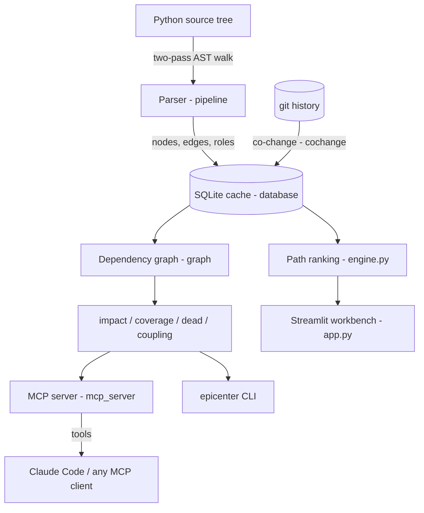

# 🌐 Epicenter

**Name a symbol. See everything that shakes.**

Epicenter parses a Python codebase into a dependency graph, then walks that graph *backwards* to answer the question developers actually ask before touching code:

> **"If I change this, what breaks?"**

It finds indirect callers that text search cannot see, tells you which of them no test reaches, and exposes all of it over [MCP](https://modelcontextprotocol.io) so AI coding assistants can consult real structure instead of inferring it from grep.

---

## Why this exists

AI coding assistants reason about repository structure by searching text and guessing. They miss indirect callers, inherited overrides, and cross-module chains. A parsed call graph doesn't — it knows that editing `fetch_graph_data` reaches `CuriosityEngine.__init__` two hops away, and it can show the chain.

That precision is the product. The graph is the means.

---

## 🚀 Quick start

```bash
pip install epicenter-mcp
```

Index a codebase, then ask:

```bash
epicenter index /path/to/repo
epicenter impact save_user
```

With more than one codebase indexed, name which to query: `--realm /path/to/repo`.

```
Changing db.save_user could affect 5 symbol(s):

  ── directly ──
    api.create_account  (function, 3 dependents)  [UNTESTED]
  ── 2 hops away ──
    web.signup_handler  (function, 0 dependents)
      via web.signup_handler <- api.create_account <- db.save_user

  1 of 5 affected symbol(s) have no test reaching them.
```

| Command | Answers |
|---|---|
| `impact <symbol>` | What breaks if this changes |
| `deps <symbol>` | What this relies on — the code to read first |
| `coverage <symbol>` | Which tests reach it |
| `coupling <symbol>` | What historically changes alongside it |
| `dead` | Symbols no entrypoint or test can reach |
| `find <query>` | Look up a symbol's qualified name |
| `index <path>` | Parse a codebase into the graph |
| `history [path]` | Mine git history for change coupling |
| `stats` | Graph size, entrypoints, tests, coverage, unresolved calls |

### From Claude Code

Add this to `.mcp.json` in any project, restart Claude Code, and approve it:

```json
{
  "mcpServers": {
    "epicenter": { "command": "epicenter-mcp" }
  }
}
```

Then ask in plain language: *"what breaks if I change fetch_graph_data?"*

Tools: `impact_of`, `test_coverage`, `change_coupling`, `dead_code`, `dependencies_of`, `find_symbol`, `index_codebase`, `list_codebases`.

---

## 🏗️ Architecture


```mermaid
graph TD
    Src[Python source tree] -->|two-pass AST walk| PL[Parser - pipeline]
    PL -->|nodes, edges, roles| DB[(SQLite cache - database)]
    Git[(git history)] -->|co-change - cochange| DB
    DB --> IM[Dependency graph - graph]
    IM --> Q[impact / coverage / dead / coupling]
    Q --> MCP[MCP server - mcp_server]
    Q --> CLI[epicenter CLI]
    MCP -->|tools| AI[Claude Code / any MCP client]
    DB --> EG[Path ranking - engine.py]
    EG --> UI[Streamlit workbench - app.py]
```

| Module | Role |
|---|---|
| [`epicenter/pipeline.py`](epicenter/pipeline.py) | Two-pass AST parser. Symbols, call resolution, role detection. |
| [`epicenter/database.py`](epicenter/database.py) | Realm-scoped SQLite cache. |
| [`epicenter/graph.py`](epicenter/graph.py) | Dependency graph and the impact/coverage/reachability queries. |
| [`epicenter/cochange.py`](epicenter/cochange.py) | Change coupling mined from git history. |
| [`epicenter/cli.py`](epicenter/cli.py) | Command line interface. |
| [`epicenter/mcp_server.py`](epicenter/mcp_server.py) | The queries as MCP tools. |
| [`epicenter/engine.py`](epicenter/engine.py) | Centrality-based path ranking (earlier direction, retained). |
| [`app.py`](app.py) | Streamlit workbench over `engine.py`. |

Everything ships inside the `epicenter` package. Its module names — `database`, `pipeline`, `engine` — are generic enough that installing them at the top level would shadow whatever else in a user's environment claims them.

### Developing on it

```bash
python3 -m venv .venv
.venv/bin/python -m pip install -e ".[dev]"
.venv/bin/python -m pytest tests -q
```

---

## 🧠 How it works

### Dependency edges vs structural edges

The central distinction. An edge `A --calls--> B` means A depends on B, so a change to B propagates back to A. An edge `module --contains--> class` means no such thing — containment describes where code lives, not what relies on what.

Keeping both in one graph makes reachability leak: you hop from a method up into its file, then back down into an unrelated method, until every symbol appears connected to every other. Epicenter keeps them in **separate graphs**, and only `calls` / `inherits` / `imports` carry a change forward.

### Impact = reverse reachability

Multi-source breadth-first search over the reversed dependency graph. BFS (not DFS) so the recorded path is the *shortest* chain of blame. Querying a class also seeds from its methods, since changing a class means changing what it contains. Results rank by distance, then fan-in — a nearby symbol many things depend on is the more dangerous one.

### Call resolution

The parser tracks variable types well enough to resolve the patterns that defeat string matching:

```python
self.db = Database()   # learned in __init__
self.db.save(row)      # → store.Database.save

local = Database()
local.save(row)        # → store.Database.save

def handler(db: Database):
    db.save(row)       # → store.Database.save
```

Types come from constructor calls, parameter annotations, and annotated assignments. Class bodies are pre-scanned before their methods are visited, because a method using `self.db` may be defined above the `__init__` that creates it.

### Roots, and what static analysis cannot see

Coverage and dead code both need to know where execution starts. Epicenter treats as roots: `__main__` guards, module-level `main`/`cli`, tests, decorator-registered functions, and modules nothing imports but which have module-level code (Streamlit apps and scripts, which never write a `__main__` guard).

Getting dead code from noisy to useful meant handling four ways a framework invokes code with no call edge to show for it:

| Invisible call | How it's handled |
|---|---|
| `ast.NodeVisitor` dispatching to `visit_Call` | A class with an **external** base may have overrides its base calls |
| `@app.route`, `@mcp.tool`, `@pytest.fixture` | Any **non-inert** decorator means registration. Enumerating inert decorators is tractable; enumerating every framework's registering ones is not |
| `@property` read as an attribute | Descriptor decorators marked implicit |
| `Foo()` linking to `Foo`, never `Foo.__init__` | Reachability computed to a **fixpoint**, so a live class pulls in its dunders and whatever they call |

On this repository that took the dead list from 46 entries to 1 — and the survivor is real.

### Change coupling

Structure is not the only kind of dependency. Two functions that always change in the same commit are coupled even when neither calls the other — a config key and the code reading it, an encoder and its decoder, a schema writer and its reader. No edge exists to find, so no amount of parsing will surface them. History will.

`epicenter history` walks recent commits, maps each diff hunk onto the symbols defined in that file **at that commit** (not today's layout, which would attribute changes to whatever happens to sit at those lines now), and counts what moves together. Each change is attributed to the innermost symbol covering it, so editing one method does not implicate its whole class.

Coupling is reported as confidence — of the commits touching this symbol, the share that also touched the other — and pairs with no code path between them are flagged, because those are the ones structure cannot tell you about. On this repository, `save_code_graph_to_db` and `fetch_graph_data` come out at 100% with nothing calling anything: the write and read halves of one schema.

It is correlation, not dependency. It needs real history to say anything — a handful of commits will pair things that merely travelled together.

### Roots

Libraries need one more root. Their callers live outside the codebase entirely, so a package's `__init__.py` re-exports — its public surface — are treated as entrypoints. Without that, every public function in a library reads as dead.

---

## ⚠️ Known limitations

Resolution is heuristic, not a type checker. It is **incomplete, and errors run toward under-reporting**: a listed caller is reliable, but *"nothing depends on this"* is the answer to distrust.

Resolved: constructor assignments, parameter and return annotations, `X | None` unions, class-body annotations (dataclass, pydantic, attrs), `self` attributes and attributes read into locals, async methods and awaited calls, closures, class-qualified calls, callbacks and bound-method references, relative imports, and package re-exports.

Not resolved:

- **Unannotated indirection** — `get_connection().execute()` where nothing declares a return type. An `Any` annotation carries no information either.
- **Containers** — `handlers = [Foo()]` then `handlers[0].run()`
- **Reassignment** — last-write-wins, so a variable changing type mid-function records wrong
- **Duck typing** — same ceiling
- **Runtime reflection** — `getattr(self, f'{key}_schema')` builds a method name from a string. Nothing static can follow it; pydantic's JSON-schema generator dispatches this way throughout.
- **Plugins loaded by path** — a mypy or pytest plugin named in a config file has no caller in the codebase at all.
- **A library's submodule API** — public surface is read from `__init__.py` re-exports. A symbol users import straight from a submodule (`from pydantic.v1.color import Color`) is indistinguishable from dead code without reading the docs. Treating every public submodule symbol as API would suppress almost everything and make the dead-code report useless, so it is left as-is.

Two more things to hold loosely:

- **Test coverage here means reachability**, not assertion. A test that reaches a symbol may not check anything about it. It is a floor on confidence, not a measure of it.
- **Dead code is a list of candidates**, never a delete list. An unresolved caller makes live code look dead.

`stats` reports **`unresolved_calls`** — call sites the parser could not tie to any symbol. Those targets are typed `unresolved` rather than filed as external libraries, so the size of the blind spot is visible instead of hidden.

Python only.

### Measured

| | This repo | A 2,700-line app | mcp SDK | pydantic | networkx |
|---|---|---|---|---|---|
| Files | 14 | 21 | 123 | 105 | 580 |
| Symbols | 171 | 126 | 1,407 | 2,300 | 8,337 |
| Dependency edges | 248 | 293 | 2,905 | 4,527 | 13,447 |
| Dead-code candidates | 1 | 3 | 42 | 229 | 7 |
| Index time | <0.1s | 0.3s | 0.7s | 1.1s | 3s |

Every one of those dead-code numbers started far higher. On the application it was 25, on networkx 581. Each round of checking the false positives by hand exposed a distinct gap — callbacks passed but never called, return annotations, relative imports, a package losing its own name, and same-module inheritance building its edge from the import map alone. Running it against code neither of us wrote found far more than self-analysis ever did.

Dynamic dispatch is handled rather than conceded. A method whose name is called on a receiver that could not be typed — `registry[key](...).solve()` — is treated as live, and so are subclass overrides of any live method, since calling a base method runs whichever override the instance carries. Neither invents a dependency edge: the call is real but its destination is genuinely unknown, and corrupting impact analysis to tidy up a different report would be the wrong trade.

The 7 that survive on networkx are backend-interface methods and test helpers reached by machinery no parser can follow.

---

## 🧪 Tests

```bash
pytest tests -q
```

74 tests covering call resolution, storage, impact queries, reachability, package layout, dynamic dispatch, and history mining. Nearly all are regressions for bugs found by running Epicenter against real code — the realm-collision data loss, closures collapsing into one node, relative imports never resolving, a package losing its own name, and each framework-dispatch false positive in the dead-code list.

---

## 📄 License

MIT — see [LICENSE](LICENSE).

---

## 🛠️ Stack

Python 3.10+ · NetworkX · SQLite · `ast` · MCP SDK · Streamlit (workbench only)

---

## 🗺️ Roadmap

- [ ] **Diff blast radius** — impact analysis across a branch or PR rather than a single symbol.
- [ ] **Context packing** — the minimal token-budgeted set of definitions needed to modify a symbol.
- [ ] **Real name resolution** — delegate to `pyright` for what heuristics cannot reach.
- [ ] **Subsystem detection** — community detection on the module graph, rendered as Mermaid.

---

## 📜 Project history

This began as a Wikipedia "rabbit hole" explorer, became a codebase path-finder that ranked routes by centrality and "serendipity," and is now Epicenter.

The path-ranking framing didn't survive contact with the problem — its own worked example returned four suggestions with identical scores, three terminating in `range`, `enumerate`, and `set`. Serendipity is a *recommender-systems* metric: wandering is the point on Wikipedia, but nobody wants to wander their codebase. They want a specific answer to a specific, anxious question.

The graph was worth keeping. The objective on top of it was not. `engine.py` and `app.py` retain the older direction and still run.
